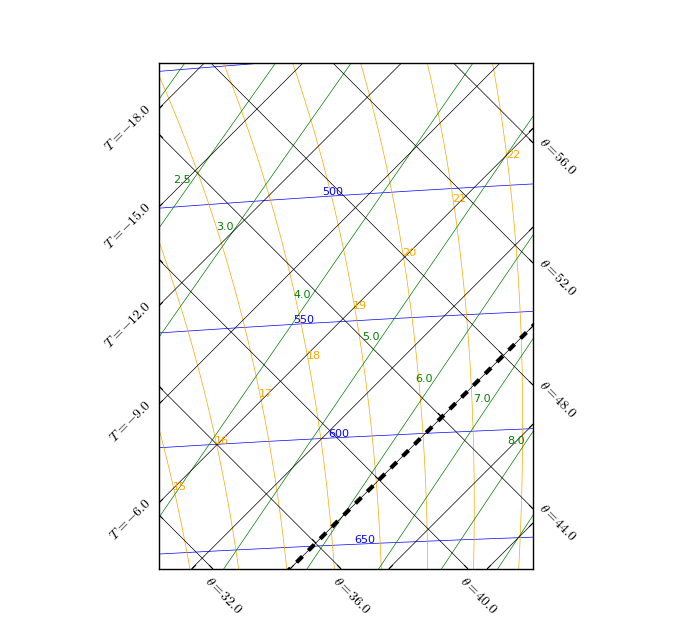
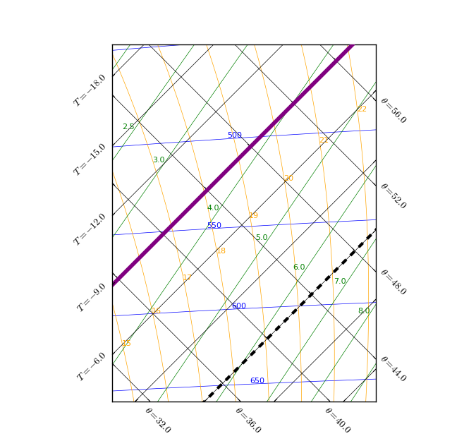
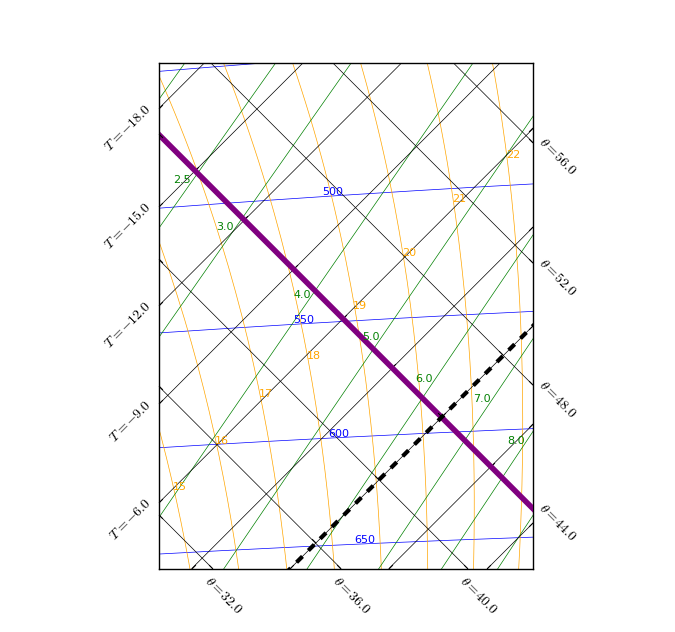
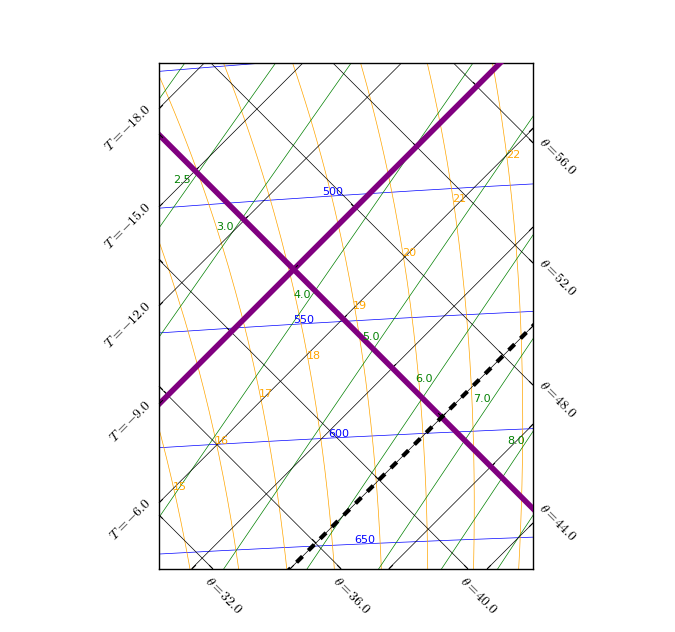

.. tephigram_user_guide_introduction:

Introduction
============

The tephigram is a thermodynamic or energy diagram, devised in 1915 by Sir William Napier Shaw, a former Director-General of the Met Office.

It is a graphical representation of the obervations of pressure, temperature and humidity, made in a vertical sounding of the atmosphere, typically from radiosondes.

The axis of the tephigram are temperature (T) and entropy (:math:`\phi`), hence the name "T-:math:`\phi`-gram".
The axes and lines of the tephigram are shown in :ref:`tephi_axes`.

.. _tephi_axes:

   *Figure 1: The tephigram.*

Axes and lines of the tephigram
-------------------------------

At first glance the tephigram appears to be a confusing mass of lines. However, on closer inspection *five* different types of lines can be identified, all of which are now described.

.. _intro-isotherm:

Isotherms
^^^^^^^^^

Isotherms are lines of constant temperature, measured in units of :sup:`o`\ C. They are straight and parallel, running at 45\ :sup:`o`\  across the tephigram from bottom left to top right of the plot.

The line representing the 0\ :sup:`o`\ C isotherm has a thick black dashed line-style.

.. _tephi_axis_isotherm:

   Figure 2: The isotherm lines.

The axis ticks to the left of the plot show the temperature values of each individual isotherm line.

.. _intro-dry-adiabat:

Dry adiabats
^^^^^^^^^^^^

Dry adiabats are lines of constant potential temperature, measured in units of :sup:`o`\ C. They are straight and parallel, running at 45\ :sup:`o`\  across the tephigram from the top left to the bottom right of the plot.

The dry adiabats represent the rate at which unsaturated air will cool when rising or warm when sinking. The dry adiabatic lapse rate (DALR) is the rate at which cooling occurs if there are no other factors increasing or
decreasing the temperature of a parcel as it rises.

.. _tephi-axis-dry-adiabat:

   Figure 3: The dry adiabat lines.

The axis ticks at the bottom and to the right of the plot show the potential temperature value of each individual dry adiabat line.

Note that, as temperature (T) and entropy (:math:`\phi`) are the axes of the tephigram, the isotherms and dry adiabats perpendicularly bisect each other, and are **not** skewed.

.. _tephi_right_angles:

   Figure 4: Relationship between the isotherm and dry adiabat lines.

.. _intro-isobar:

Isobars
^^^^^^^

Isobars are lines of constant pressure, measured in units of millibars or hectopascals. They are almost horizontal and straight and their vertical spacing increases as their value decreases. The highest valued isobar is at the
bottom of the plot and the lowest valued isobar is at the top, akin to our atmosphere.

.. _tephi_axis_isobar:

.. figure:: figures/tephi_axis_isobar.png
   :scale: 70 %
   :align: center

   Figure 5: The isobar lines.

The value of each individual isobar line is always shown *within* the plot beside the isobar line. By default, isobar lines and text values are blue.

.. _intro-humidity-mixing-ratio:

Humidity mixing ratio
^^^^^^^^^^^^^^^^^^^^^

Humidity mixing ratio lines are lines of constant saturation mixing ratio with respect to a plane water surface, measured in units of g kg\ :sup:`-1`\ . They run diagonally across the plot from bottom left to top right.

A humidity mixing ratio line represents the number of grams of water required to saturate 1 kg of air at a particular temperature and pressure.

.. _tephi_axis_mixing:

.. figure:: figures/tephi_axis_mixing.png
   :scale: 70 %
   :align: center

   Figure 6: The humidity mixing ratio lines.

The value of each humidity mixing ratio line is always shown *within* the plot beside the line. By default, humidity mixing ratio lines and text values are green.

.. _intro-saturated-adiabat:

Pseudo saturated wet adiabats
^^^^^^^^^^^^^^^^^^^^^^^^^^^^^

Saturated adiabats are lines of constant equivalent potential temperature for saturated air parcels, measured in units :sup:`o`\ C. They run as vertically curved lines across the plot from top to bottom.

The saturated adiabats represent the rate at which saturated air will cool when rising i.e. the saturated adiabatic lapse rate (SALR).  

.. _tephi_axis_wet_adiabat:

.. figure:: figures/tephi_axis_wet_adiabat.png
   :scale: 70 %
   :align: center

   Figure 7: The saturated adiabat lines.

The value of each saturated adiabat line is always shown *within* the plot beside the line. By default, saturated adiabat lines are text values are orange.
